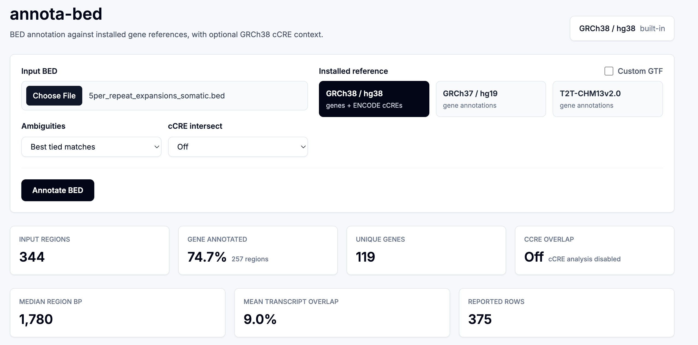
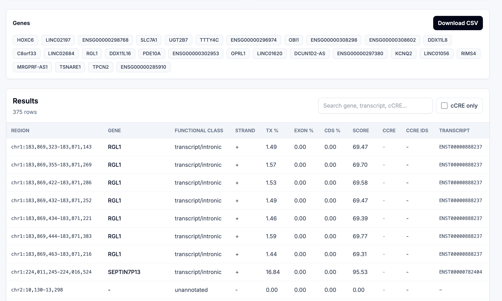

<p align="center">
  <h1 align="center">annota-bed</h1>
</p>

<p align="center">
  <em>Fast and easy annotation of BED files for contextual genomic analysis</em>
</p>

<p align="center">
  
</p>

<p align="center">
  
</p>

---

## Attribution

This project was inspired by [vladsavelyev/bed_annotation](https://github.com/vladsavelyev/bed_annotation) and extended into a full-stack tool with a Next.js frontend and Flask backend.

## Overview

`annota-bed` is a lightweight full-stack tool for annotating BED files against local reference genome annotations.  

Instead of manually intersecting BEDs with GTFs and parsing outputs, `annota-bed` provides an interactive web interface where you can:

- Upload a **BED file** (`chr`, `start`, `end`)  
- Select a built-in reference genome from the local `data/` directory  
- Optionally upload a custom bgzipped/tabix-indexed GTF  
- Optionally intersect GRCh38 regions with the ENCODE cCRE catalog  

The tool then returns **gene- and transcript-level annotations**, interactive plots, and a downloadable CSV.  

---

## Supported Reference Genomes

We currently support three reference genomes out-of-the-box, all bgzipped and tabix-indexed for fast queries:  

| Genome Build | Source | Notes |
|--------------|--------|-------|
| **GRCh37 / hg19** | [Ensembl GRCh37 release-115 GTF](https://ftp.ensembl.org/pub/grch37/release-115/gtf/homo_sapiens/) | Standard Ensembl release |
| **GRCh38 / hg38** | [Ensembl current GTF](https://ftp.ensembl.org/pub/current_gtf/homo_sapiens/) | Standard Ensembl release |
| **T2T-CHM13v2.0** | [HPRC CHM13 GFF3 annotation](https://s3-us-west-2.amazonaws.com/human-pangenomics/T2T/CHM13/assemblies/annotation/chm13.draft_v2.0.gene_annotation.gff3) | Converted from GFF3 → GTF, then bgzipped and tabix-indexed |

Users can seamlessly switch between hg19, hg38, and CHM13 when annotating motifs, enabling cross-genome comparisons.  

For GRCh38, the app can also intersect user regions against `GRCh38-cCREs.bed`. This is optional and can be run only on regions that did not get a gene hit, or across all input regions.

---

## How It Works

1. **User Input**
   - Upload a BED file with 3 columns: chromosome, start, end.  
   - Choose hg19, hg38, or CHM13 from the installed references.  
   - For non-packaged references, enable custom GTF upload and provide a tabix-indexed GTF (`.gtf.bgz`) plus its `.tbi` index.  

2. **Backend (Flask)**
   - Uses [pysam](https://pysam.readthedocs.io/en/latest/) to query GTF annotations in genomic intervals.  
   - Each BED region is intersected against transcripts, exons, and CDS features.  
   - cCRE mode uses the local GRCh38 cCRE BED as a regulatory-region follow-up when requested.  

3. **Annotation Priority**
   If multiple overlapping transcripts/features are found, the tool applies a priority system:
   - Transcript overlap %  
   - CDS overlap %  
   - Exon overlap %  
   - Biotype (protein_coding > others > \*RNA > \*_decay > sense\_* > antisense > translated\_* > transcribed\_*)  
   - Presence of HUGO gene symbol  
   - Transcript length  

4. **Frontend (Next.js + Recharts)**
   - Shows summary metrics for input regions, gene hits, overlap classes, and cCRE intersections  
   - Plots functional classes, biotypes, chromosome distribution, and cCRE catalog-relative composition  
   - Displays gene names, transcript IDs, cCRE IDs, and overlap percentages  
   - Provides a searchable results table  
   - Exportable CSV  

---

## User Options

- **Ambiguities**
  - `best_all` (default): Keeps all top matches if tied by priority.  
  - `best_one`: Returns only the single best match.  
  - `all`: Returns all overlapping annotations (no filtering).  

- **Custom GTF Uploads**  
  Users can upload any **Ensembl-style GTF** (properly sorted, bgzipped, tabix-indexed) for other organisms/genomes.  

- **cCRE Intersect**
  - `Off` (default): Runs gene/transcript annotation only.
  - `Unannotated regions`: Intersects only regions without a gene/transcript hit against GRCh38 cCREs.
  - `All regions`: Intersects every input region against GRCh38 cCREs.
  - Optional permutation enrichment preserves input interval widths, randomizes them across hg38 primary chromosomes, and reports observed regions, expected regions, fold enrichment, and empirical p-value for each cCRE class.

---

## Running Locally

Clone the repo:

```bash
git clone https://github.com/<your-username>/annota-bed.git
cd annota-bed

# Frontend
pnpm install
# or npm install / yarn install

# Backend (Python)
pip install -r requirements.txt

# Start Flask + Next.js together
pnpm dev
